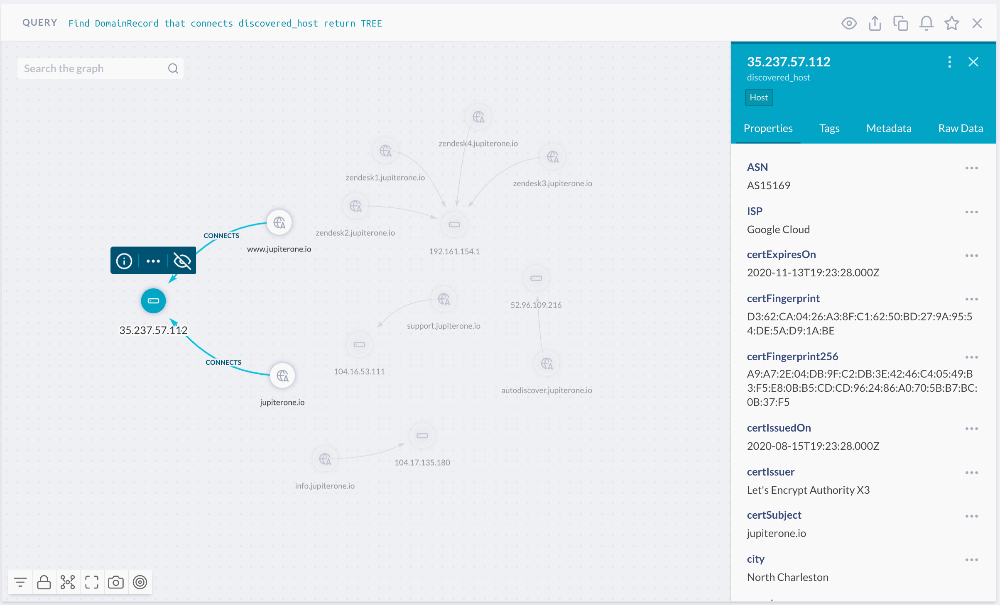

# nslookup-shodan

This repo contains an automation script to enrich the domain records mapping in a JupiterOne account.
The script performs the following actions:

- Run a J1QL query to retrieve a list of `DomainRecord` entities that do not already connect with an
  existing target entity in the graph.

- For each "orphaned record":
  
  - Perform `nslookup` to get the target IP address.

  - Use the IP address to perform a **Shodan** query to retrieve some host details, without performing 
    an active scan of the host.

  - If the host has port 443 open, connect via HTTPS to retrieve certificate information.

  - Create the `discovered_host` entity and connect the `DomainRecord` entity to it in the JupiterOne
    graph.

## How to use it

Install `node.js` and `yarn` locally.

Create a `.env` file locally in the project root directory, with your JupiterOne account ID, API key, 
and Shodan API key. The file should look like this:

```text
J1_ACCOUNT_ID=abc
J1_API_TOKEN=........
SHODAN_TOKEN=........
```

Next, run the script:

```bash
yarn && yarn start
```

The script uses JupiterOne Bulk Upload / Synchronization API, which completes the update to graph
asynchronously in the background. It typically takes less than a few minutes to complete after the
upload.

You can run the following J1QL query to see the graph:

```j1ql
FIND DomainRecord THAT CONNECTS discovered_host RETURN TREE
```

Here's an example screenshot:


